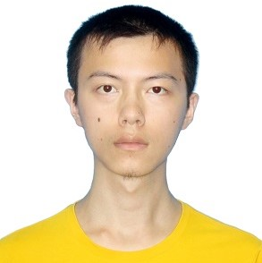
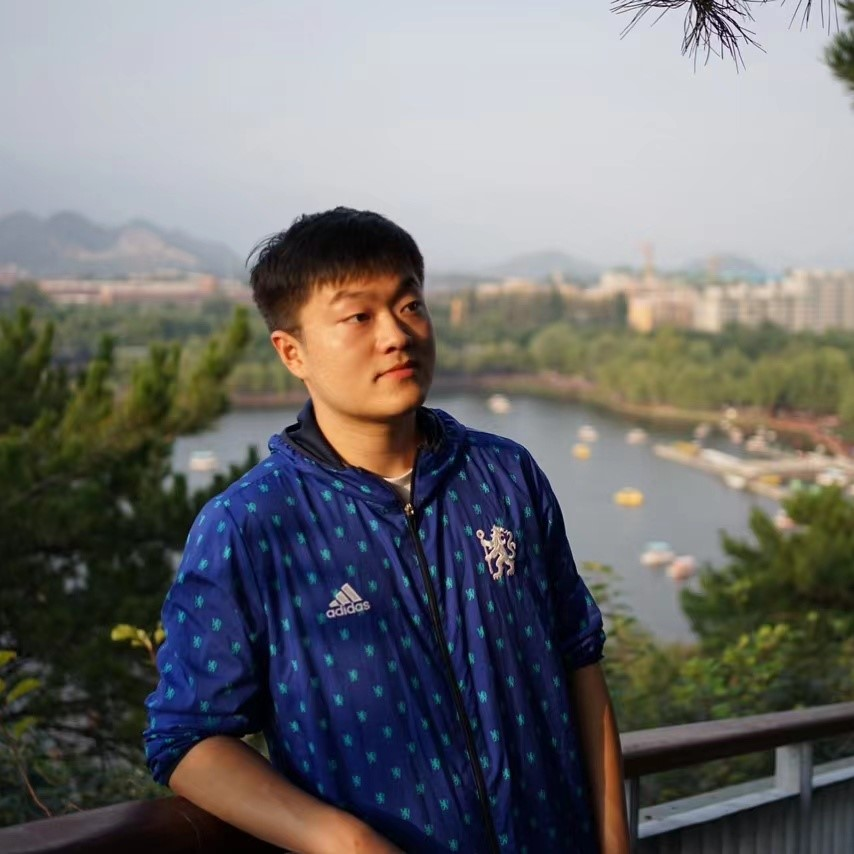

Welcome to our KDD' 23 Tutorial, "Causal Discovery from Temporal Data".

Website: https://chaunceykung.github.io/temporal-causal-discovery-tutorial/


## Tutorial Abstract

Temporal data representing chronological observations of complex systems can be ubiquitously collected in smart industry, medicine, finance and etc. In the last decade, many tasks have been studied for mining temporal data and offered significant value for various applications. Among these tasks, causal discovery aims to understand the underlying generation mechanism of temporal data and has attracted much research attention. According to whether the data is calibrated, existing causal discovery approaches can be divided into two subtasks, i.e., multivariate time-series causal discovery, and event sequence causal discovery. Previous tutorials or surveys have primarily focused on causal discovery from time-series data and disregarded the second ones. In this tutorial, we elucidate the correlation between the two subtasks and provide a comprehensive review of the existing solutions. Moreover, we offer some potential applications and summarize new perspectives for discovering causal relations from temporal data. We hope the audiences can obtain a systematic overview of this topic and inspire some new ideas for their own research. 


## Tutorial Materials and Outline

### Tutorial slides (to be updated)
* [[Part 1]](https://github.com/ChaunceyKung/temporal-causal-discovery-tutorial/blob/main/slides/KDD_Causal_Discovery_Part%201_Introduction.pdf) Introduction
* [[Part 2]](https://github.com/ChaunceyKung/temporal-causal-discovery-tutorial/blob/main/slides/KDD_Causal_Discovery_Part%202_MTS.pdf) MTS
* [[Part 3]](https://github.com/ChaunceyKung/temporal-causal-discovery-tutorial/blob/main/slides/KDD_Causal_Discovery_Part%203_Event.pdf) Event sequence
* [[Part 4]](https://github.com/ChaunceyKung/temporal-causal-discovery-tutorial/blob/main/slides/KDD_Causal_Discovery_Part%204_Discussion.pdf) Discussion


### Our [[survey paper]](https://arxiv.org/abs/2303.10112) 

### Tutorial Outline

1. Introduction
  - Background and Preliminary
  - Introduction to Causal Discovery
  - Problem Definitions

2. Causal Discovery from Multivariate Time Series
  - Constraint-Based Approaches
  - Score-Based Approaches
  - FCM-Based Approaches
  - Granger Causality-Based Approaches
  - Others

3. Causal Discovery from Event Sequence
  - Granger Causality-Based Approaches
  - Constraint-Based Approaches
  - Score-Based Approaches

4. Applications and New Perspectives
  - Applications: root cause analysis, anomaly detection, video analysis, bioinformatics, business intelligence in E-commerce, urban data analysis, etc.
  - New Perspectives: amortized casual discovery, supervised casual discovery, and causal representation learning


## Short Bio of Lecturers and Contributors

Our team has rich research experience in temporal data analysis. We have published over 30 papers on trajectory representation learning, anomaly detection, and causal inference. During our research, we found that the causal structure underlying the temporal data would be generally beneficial to many tasks. Thus, we summarize the cutting-edge techniques of causal discovery and propose this tutorial.


**[Chang Gong](https://chaunceykung.github.io/)** is currently a second-year Ph.D. student at the Institute of Computing Technology, Chinese Academy of Sciences. He received the B.S. degree in computer science and technology from Tongji University, Shanghai, China, in 2021. His research interests include causal discovery, computational advertising, and root cause analysis.


**[Di Yao](http://www.yaodi.info/)** is an associate professor at the Institute of Computing Technology, Chinese Academy of Sciences. Before joining ICT, he obtained his Ph.D. degree in University of Chinese Academy of Sciences supervised by Prof. Jingping Bi. Previously he conducted one year visiting at DMAL, Nanyang Technological University under the supervision of Prof. Gao Cong. His research interest lies on time series analysis, anomaly detection and causal discovery.


**[Chuzhe Zhang]()** is an AI research assistant at the Institute of Computing Technology, Chinese Academy of Sciences. He received his BS degree from Fudan University in 2023. His research interests include temporal causal discovery and financial time-series forecasting.


**[Wenbi Li]()** is currently a Ph.D. candidate at the Institute of Computing Technology, Chinese Academy of Sciences. He received the B.S. degree in computer science and technology from the University of Science and Technology of China. His research interests include time-series analysis, anomaly detection, and causal inference.


**[Jingping Bi](http://www.ict.cas.cn/sourcedb_2018_ict_cas/cn/jssrck/200909/t20090917_2496583.html)** is currently a full professor at the Institute of Computing Technology, Chinese Academy of Sciences. She received her Ph.D. in 2002 from the Institute of Computing Technology, Chinese Academy of Sciences. Her research interests include network measurement, routing, virtualization, SDN, and big data. She is an IEEE Member.

**[Lun Du](https://www.microsoft.com/en-us/research/people/ludu/)** is a Senior Researcher in the DKI (Data, Knowledge, Intelligence) area at Microsoft Research Asia. He has been working in the same research group since he joined Microsoft in July 2019. His research interests include techniques of machine learning, data mining, graph models and their applications in software engineering, and tabular data understanding. He has published 40+ papers in top conferences and journals, such as KDD, WWW,  NeurIPS, ICLR, ICSE, IJCAI, AAAI, ACL, EMNLP, WSDM, CIKM, TKDD, etc., and his papers won the Best Paper Runner-up Award at CIKM’19 and Best Short Paper Award at CIKM’21. He has been a senior PC member of IJCAI’21 and a PC member of AAAI’21 22 23, WWW’20 22 23, ICML’22 23, KDD’22 23, NeurIPS’22 23, and WSDM’23. Before joining Microsoft Research, he received his M.S. from Peking University, Beijing, China, in 2019.

**[Jin Wang](https://www.jinwang18.net/)** is a Research Scientist and Research Lead in Megagon Labs. He obtained his Ph.D. degree from Computer Science Department, University of California, Los Angeles in July 2020 under the supervision of Professor Carlo Zaniolo. Before that, he obtained his Master degree of Engineering from Department of Computer Science and Technology, Tsinghua Univeristy in 2015. His research interest lies in the broad areas of database, machine learning and information retrieval. In particular, his research focuses on Database Query Language, Database System and using database technologies to boost the applications in data integration and natural language processing. He is a member of ACM and IEEE.

**[Jiayan Guo]()** is a PhD candidate at Peking University. He received B.S. degree at Beijing Institute and Technology at 2019. His research interests include data mining, natural language processing, graph machine learning and their applications for recommender systems. He has published papers on top-tier conferences like KDD, WWW, WSDM and CIKM. His paper won the Best Paper Award Honorable Mention at WSDM 2023.


## Cite our work 

If you find our work useful, please cite our work
- KDD 2023 Tutorial (Causal Discovery from Temporal Data)
- Survey paper (Causal Discovery from Temporal Data: An Overview and New Perspectives)
```
@article{gong2023causal,
  title={Causal Discovery from Temporal Data: An Overview and New Perspectives},
  author={Gong, Chang and Yao, Di and Zhang, Chuzhe and Li, Wenbin and Bi, Jingping},
  journal={arXiv preprint arXiv:2303.10112},
  year={2023}
}

@inproceedings{kdd/Gong0ZLBDW23,
  author       = {Chang Gong and
                  Di Yao and
                  Chuzhe Zhang and
                  Wenbin Li and
                  Jingping Bi and
                  Lun Du and
                  Jin Wang},
  title        = {Causal Discovery from Temporal Data},
  booktitle    = {Proceedings of the 29th {ACM} {SIGKDD} Conference on Knowledge Discovery
                  and Data Mining, {KDD} 2023, Long Beach, CA, USA, August 6-10, 2023},
  pages        = {5803--5804},
  publisher    = {{ACM}},
  year         = {2023}
}
```


<script type="text/javascript" id="clustrmaps" src="//clustrmaps.com/map_v2.js?d=8szPTSzsKjr4sJsqpi8rGoh4vjdKjatvub51BhT0rEc&cl=ffffff&w=a"></script>

